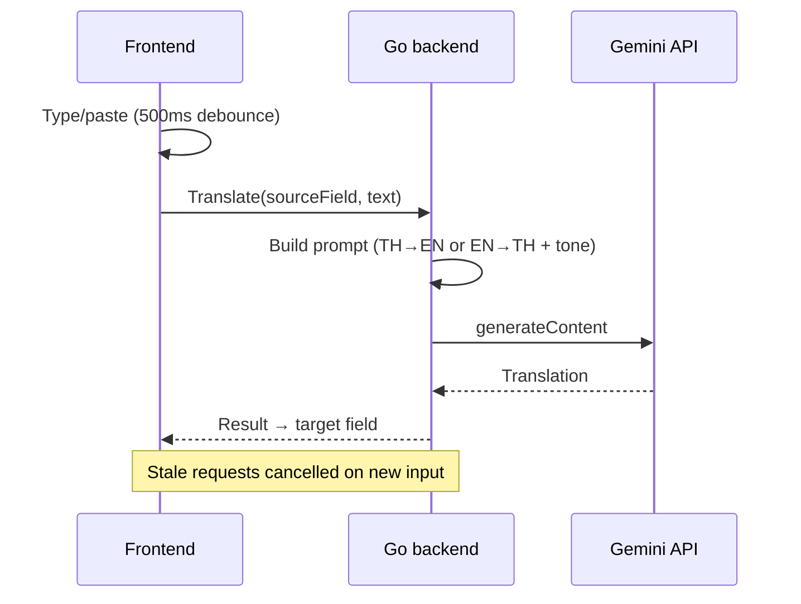

# Win Translator — Project Knowledge

> Personal Windows desktop app for fast Thai ↔ English translation via Google Gemini.  
> **Status:** v1 shipped · **Date:** 2026-06-12 · **Repo:** `win-translator`

---

## Table of contents

1. [Overview](#1-overview)
2. [Tech stack](#2-tech-stack)
3. [Architecture](#3-architecture)
4. [Design decisions](#4-design-decisions)
5. [Config and security](#5-config-and-security)
6. [Usage and commands](#6-usage-and-commands)
7. [Lessons learned](#7-lessons-learned)
8. [Project workflow (IOM tasks)](#8-project-workflow-iom-tasks)
9. [Out of scope v1](#9-out-of-scope-v1)
10. [Key paths](#10-key-paths)

---

## 1. Overview

**Win Translator** is a small Windows helper app for **Thai ↔ English** translation.

| Aspect | Detail |
|--------|--------|
| Purpose | Quick translation while working on Windows |
| Launch | Global hotkey `Ctrl+Shift+T` |
| Background | System tray (minimize on close, not quit) |
| Engine | Google Gemini API |
| UI | Dark theme; Thai + English text areas; tone selector |
| Output | Portable `.exe` via `wails build` |

**In scope:** hotkey launcher, dual text boxes, tone (กันเอง / สุภาพ / ทางการ), copy/paste helpers, standalone exe.

**Out of scope:** mobile, web-only, non-Gemini backends.

---

## 2. Tech stack

| Layer | Choice | Why |
|-------|--------|-----|
| Framework | **Wails 2** | Go backend + web UI; small exe; WebView2 on Windows |
| Backend | **Go 1.23+** | Hotkey, tray, config, Gemini client |
| Frontend | **Vanilla JS + Vite** | Simple UI without heavy framework |
| Translation | **Gemini REST API** | `generateContent` over HTTP |
| Default model | **`gemini-2.5-flash`** | Replaces retired `gemini-2.0-flash` |
| Config | `%APPDATA%\WinTranslator\config.json` | API key encrypted with **Windows DPAPI** |
| Tray | `github.com/getlantern/systray` | Open / Settings / Quit |
| Hotkey | `golang.design/x/hotkey` | `Ctrl+Shift+T` |

**Distribution modes:**

- **Dev:** `wails dev` (optional `GEMINI_API_KEY` env var)
- **Release:** `wails build` → `app/build/bin/win-translator.exe`

**Prerequisites:** Go 1.23+, Node.js 18+, Wails CLI, WebView2 Runtime (built into Windows 11).

---

## 3. Architecture

```
app/
├── main.go              # Wails entry, single-instance lock
├── app.go               # Bindings: Translate, Settings, window control
├── tray.go              # System tray menu
├── hotkey_windows.go    # Ctrl+Shift+T
├── internal/
│   ├── config/          # Load/save config, model migration
│   ├── dpapi/           # Encrypt/decrypt API key (Windows)
│   └── gemini/          # Gemini HTTP client + prompts
└── frontend/
    ├── index.html       # Main + Settings views
    └── src/main.js      # Debounce, paste/copy, tone UI
```

### Translation flow



1. User types or pastes in focused field (source).
2. Frontend debounces 500ms (paste = immediate).
3. Go builds system + user prompt with tone.
4. Gemini API returns translation.
5. Result written to opposite field (target).
6. In-flight request cancelled if input changes.

---

## 4. Design decisions

### Window and hotkey

| Decision | Value |
|----------|-------|
| Hotkey | `Ctrl+Shift+T` — toggle show/hide |
| On show | Focus last-used field (Thai or English) |
| Tray menu | Open / Settings / Quit |
| Close (X) | Minimize to tray (does not quit) |
| Window position | Remember last position |
| Always on top | On by default; toggle in Settings |
| Single instance | Second launch focuses existing window |

### Translation UX

| Decision | Value |
|----------|-------|
| Trigger | Auto after 500ms debounce + immediate on paste |
| Source/target | Focused field = source; other = target |
| Empty source | Clear target field |
| Tone change | Re-translate immediately |
| In-flight | Show loading; cancel superseded requests |
| Errors | Show below target field |

### Copy / paste

- Per-field **Paste** and **Copy** buttons (Thai and English).
- Paste → insert → focus as source → translate immediately.
- Copy → clipboard + toast “คัดลอกแล้ว”.
- Standard `Ctrl+C` / `Ctrl+V` inside text areas.

### Gemini prompts

- **System prompt:** fixed translator role; output translation only.
- **User prompt:** separate templates for **TH→EN** and **EN→TH**.
- **Tone:** casual (กันเอง) / polite (สุภาพ) / formal (ทางการ).
- **Rules:** natural phrasing; preserve proper nouns, URLs, numbers.

### Settings

| Field | Detail |
|-------|--------|
| API key | Masked input; stored encrypted (DPAPI) |
| Gemini model | Dropdown — see models below |
| Always on top | Checkbox |
| Test connection | Calls Gemini with current settings |
| Delete key | Clears stored API key |

**Selectable models:**

- `gemini-2.5-flash` (default)
- `gemini-2.5-flash-lite`
- `gemini-2.5-pro`

**Dev fallback:** environment variable `GEMINI_API_KEY`.

---

## 5. Config and security

**Path:** `%APPDATA%\WinTranslator\config.json`

**Example structure:**

```json
{
  "encrypted_api_key": "...",
  "gemini_model": "gemini-2.5-flash",
  "always_on_top": true,
  "window_x": 860,
  "window_y": 512,
  "window_width": 482,
  "window_height": 480,
  "last_field": "thai",
  "tone": "casual"
}
```

| Rule | Detail |
|------|--------|
| API key storage | Encrypted with Windows DPAPI |
| API key in code | Never logged or committed to git |
| Model migration | `gemini-2.0-flash` → `gemini-2.5-flash` automatically |
| Model normalize | Also handles `models/` prefix and unknown models |

---

## 6. Usage and commands

### Development

```powershell
cd app
$env:Path = "$env:USERPROFILE\go\bin;$env:Path"
$env:GEMINI_API_KEY = "your-key-here"
wails dev
```

### Build portable exe

```powershell
cd app
wails build
# Output: app/build/bin/win-translator.exe
```

### Runtime

1. Run exe — app stays in system tray.
2. Press **Ctrl+Shift+T** — show/hide translator.
3. Tray → **Settings** — set API key and Gemini model.
4. Type or paste Thai/English — other field translates automatically.
5. Select tone: กันเอง / สุภาพ / ทางการ.

### After updating the app

1. Tray → **Quit** (required — closing window only minimizes).
2. Launch new `win-translator.exe`.

Only one instance runs; launching again focuses the existing window.

---

## 7. Lessons learned

| Problem | Cause | Fix |
|---------|-------|-----|
| `gemini-2.0-flash is no longer available` | Google retired the model | Default `gemini-2.5-flash` + Settings model picker |
| Error persists after code fix | Old process still running in tray | Tray → **Quit** all instances before new exe |
| Code update not applied | Close (X) = minimize to tray, not quit | Must use tray **Quit** to reload binary |

---

## 8. Project workflow (IOM tasks)

This repo uses **IOM todo skills** for agent-driven development:

| Skill | Purpose |
|-------|---------|
| `iom-todo-task` | Create and execute task checklists |
| `iom-todo-task-archive` | Archive completed tasks |
| `iom-todo-handoff` | Session handoff for next agent |

### Task history (archived 2026-06-12)

| ID | Title | Outcome |
|----|-------|---------|
| 000 | Project bootstrap | AGENTS + task index/log |
| 001 | Design interview | Wails stack, UX, Gemini prompts locked |
| 002 | Implementation | Full app under `app/` |
| 003 | Gemini model picker | Model dropdown + migration + single-instance |

**Agent reload chain:** `AGENTS.md` → `task/session.handoff-close.md` → `task/index.md`

---

## 9. Out of scope v1

Deferred to future versions:

- Customizable global hotkey
- Dynamic Gemini model list from API
- Start with Windows (autostart)
- Translation history / favorites

---

## 10. Key paths

| Item | Path |
|------|------|
| Application source | `app/` |
| Executable | `app/build/bin/win-translator.exe` |
| Dev/build docs | `app/README.md` |
| Agent instructions | `AGENTS.md` |
| Session handoff | `task/session.handoff-close.md` |
| Archived tasks | `task/archive/2026-06-12/` |
| Original requirements | `task/prompt.md` |
| This knowledge doc | `docs/win-translator-knowledge.md` |

---

## Related links

- [Wails](https://wails.io/)
- [Google Gemini API](https://ai.google.dev/)
- [WebView2 Runtime](https://developer.microsoft.com/microsoft-edge/webview2/)
